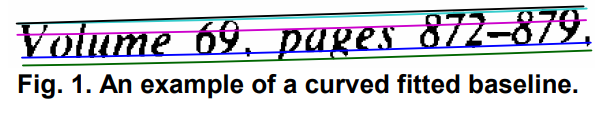
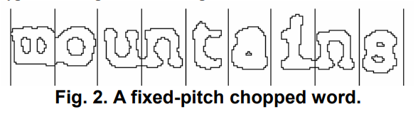
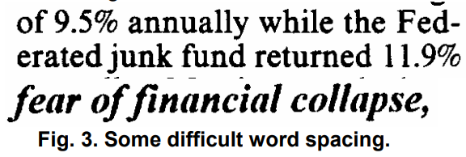
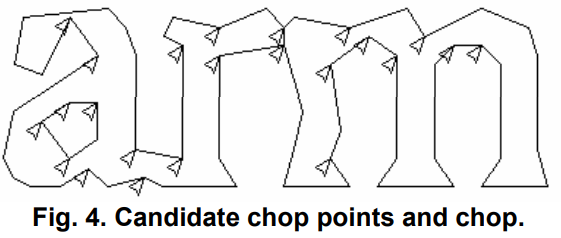
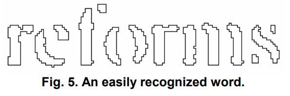
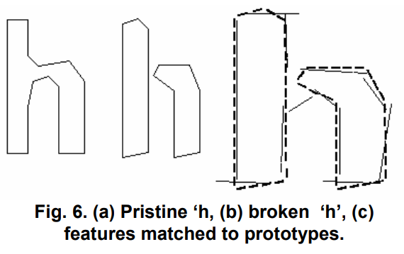
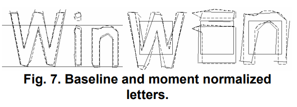

# Tesseract OCR

Murilo Kenichiro Senaga, 10395789

## 1. O que é?  
O Tesseract é um software de reconhecimento óptico de caracteres (OCR) de código aberto, projetado para converter imagens de texto em texto editável, permitindo que documentos digitalizados sejam transformados em formatos que podem ser facilmente manipulados e pesquisados. O Tesseract é amplamente utilizado em aplicações que necessitam de extração de texto a partir de imagens, como digitalização de documentos, leitura de placas e reconhecimento de texto em fotos.

## 2. História do Tesseract
O Tesseract foi desenvolvido originalmente na Hewlett-Packard Laboratories Bristol UK e na Hewlett-Packard Co, Greeley Colorado USA entre 1985 e 1994, com mais algumas mudanças feitas em 1996 para portar para o Windows. Em 2005, o Tesseract foi aberto pela HP e foi desenvolvido pelo Google de 2006 até novembro de 2018. Atualmente, o projeto está hospedado no GitHub e é mantido por uma comunidade ativa de desenvolvedores.

## 3. Funcionamento
O Tesseract OCR realiza o reconhecimento de texto em imagens em várias etapas sequenciais, desde a identificação de linhas de texto até a classificação adaptativa de caracteres.

### Etapas do Processo de Reconhecimento
### 3.1 Filtragem de Blobs
Inicialmente, o Tesseract identifica "blobs", que são regiões conectadas de pixels representando caracteres ou partes deles. Blobs muito grandes ou sobrepostos são eliminados, e os restantes são organizados por coordenadas para formar linhas de texto. Em seguida, o método da menor mediana dos quadrados é utilizado para ajustar as linhas de base, mesmo em páginas inclinadas, permitindo mesclar blobs horizontalmente e formar palavras completas.

### 3.2 Ajuste de Linhas de Base
O Tesseract aplica uma spline quadrática às linhas de base para lidar com irregularidades, como texto curvado em documentos escaneados. Isso permite o alinhamento correto dos blobs, essencial para que as linhas de texto sejam reconhecidas independentemente de eventuais curvaturas.

### 3.3 Detecção de Largura Fixa e Proporcional
Para linhas de largura fixa, o algoritmo usa o espaçamento uniforme entre caracteres para segmentar as palavras em caracteres individuais. Em textos proporcionais, onde o espaçamento varia, o Tesseract analisa os espaços entre caracteres em uma faixa limitada, garantindo a segmentação correta mesmo com espaçamentos variados.

  

### 3.4 Detecção de Linhas e Palavras
O Tesseract identifica as linhas e palavras com precisão. Para isso, os blobs que representam linhas de texto são ajustados com uma spline quadrática para lidar com curvaturas. Em textos de espaçamento fixo, as palavras são segmentadas em caracteres logo após essa etapa. Em textos proporcionais, a análise do espaçamento permite a identificação exata dos caracteres.

### 3.5 Segmentação e Reconhecimento de Palavras
Com as linhas e palavras identificadas, o algoritmo segmenta as palavras em caracteres. O "chopper" separa caracteres unidos e, quando necessário, o "associator" combina partes fragmentadas para formar caracteres completos.

  

### 3.6 Classificação de Caracteres
O processo de reconhecimento envolve um classificador de caracteres estático, que utiliza características geométricas como posição e ângulo para diferenciar os caracteres. Este classificador é treinado com base em um número limitado de amostras, mas é eficiente mesmo para caracteres danificados. A classificação ocorre em duas etapas: uma pré-classificação inicial, que gera uma lista de possíveis caracteres, seguida por uma classificação refinada.

### 3.7 Análise Linguística
Após a segmentação, o Tesseract realiza uma análise linguística para verificar a frequência e a compatibilidade das palavras com o dicionário e regras gramaticais. Isso aumenta a precisão do OCR, especialmente ao interpretar palavras que fazem sentido no contexto do documento.

### 3.8 Classificador Adaptativo
Além do classificador estático, o Tesseract utiliza um classificador adaptativo, que é ajustado dinamicamente para se adaptar melhor à fonte específica do documento. Isso melhora a precisão, especialmente em textos com fontes variadas ou danificadas.

### 3.9 Resultados
Combinando todas essas técnicas, o Tesseract pode reconhecer uma variedade de estilos tipográficos e lidar com espaçamentos variados e caracteres danificados. As análises linguística e adaptativa tornam o Tesseract uma ferramenta eficaz para OCR, mesmo em documentos escaneados sem alinhamento perfeito ou com fontes diferentes.
